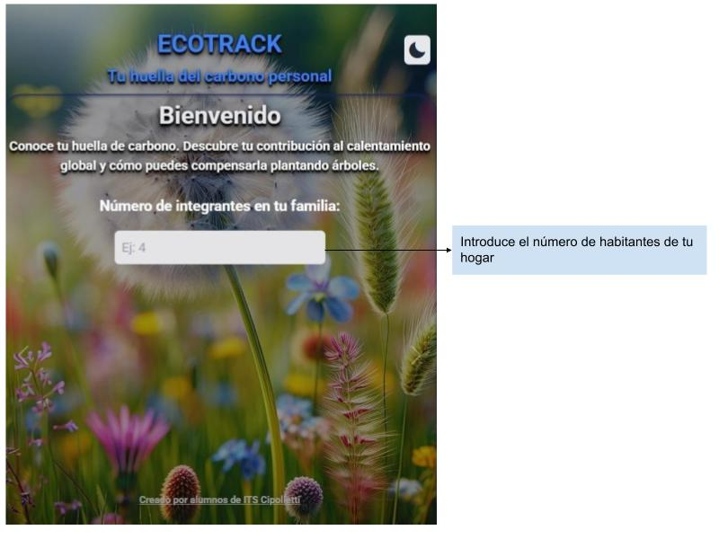
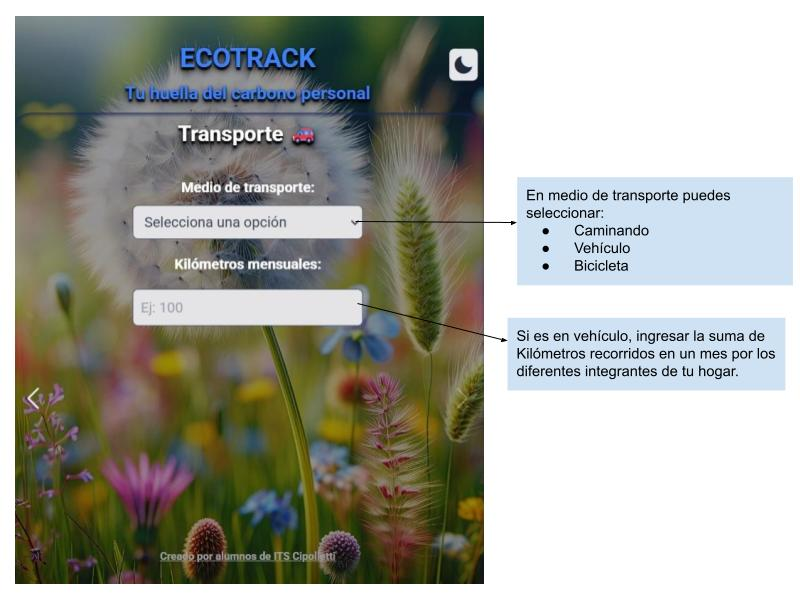
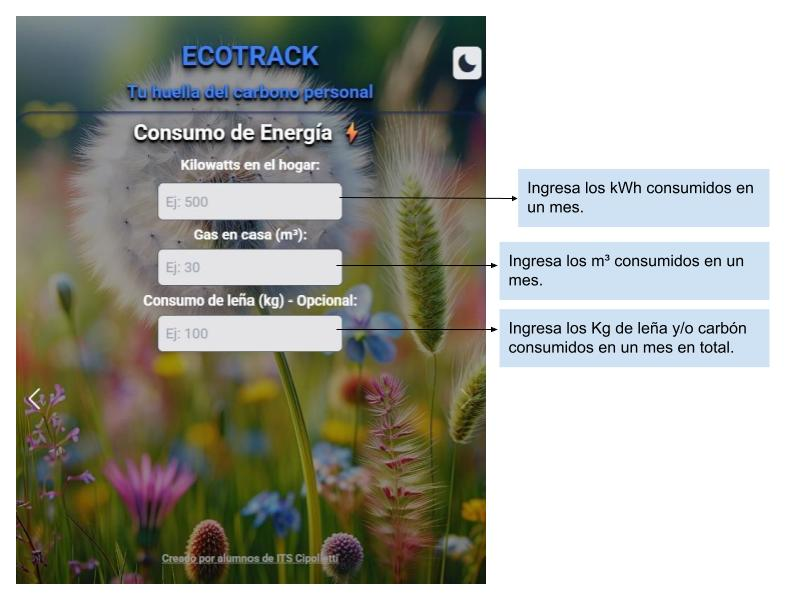
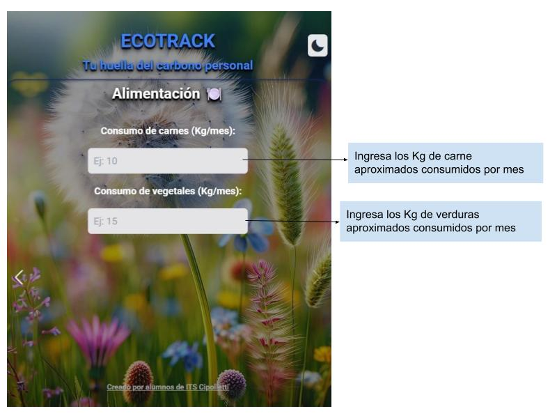
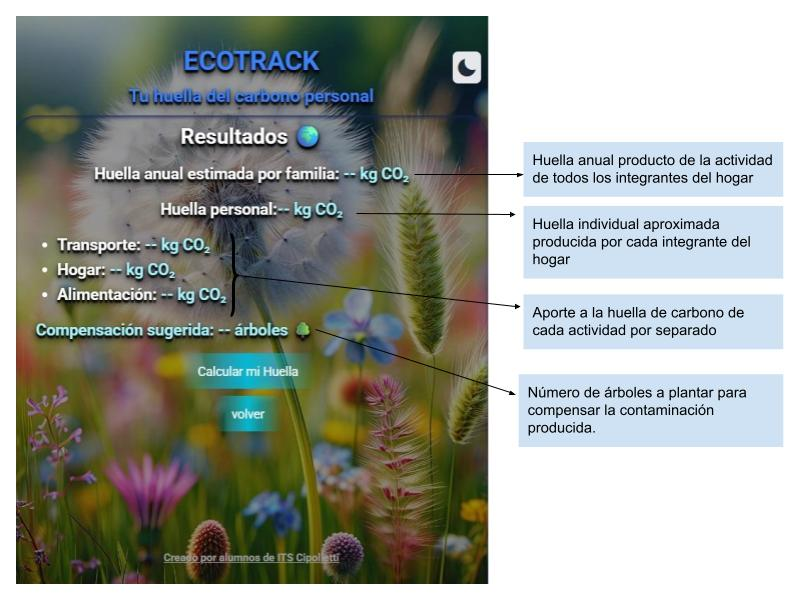

# ECOTRACK
## Introducción 

La huella de carbono es un indicador ambiental que mide la cantidad total de gases de efecto invernadero (GEI) emitidos de forma directa o indirecta por **actividades humanas:**
1. Consumo de energía.
1. Transporte.
1. Producción y consumo de bienes y servicios. 

Se expresa en toneladas de CO₂ equivalente y cuantifica el impacto de una persona, hogar, empresa, producto o país en el cambio climático. 

## Descripcion de la APP

ECOTRACK es una App adaptable a las pantallas de diferentes dispositivos que esta diseñada para calcular la huella de carbono anual de tu hogar y también la personal. Esto quiere decir la cantidad de Kg de CO₂ (equivalente) que produduce la actividad de todas las personas de tu hogar y la individual a lo largo de un año. Además brinda información aproximada de cuantos arboles son necesarios plantar para compensar la contaminación producida con CO₂.


## Calcula la cantidad de CO₂ que liberas con tus actividades en un año

### Pantallas de ingreso de datos
En la pantalla **Inicial** debes:

* **Ingresar el número de personas que residen en tu hogar.**
 



En la pantalla **Transporte** debes:

**1. Seleccionar el medio de transporte habitual.**

**2. Ingresar los kilometros mensuales recorridos aproximados.**

Ejemplo: Si dos personas utilizan un auto sin compartir el vehiculo, podria ser en horarios diferentes. Y cada persona realiza 100 Km al mes, deberan ingresarse 200 Km.  




En la pantalla **Consumo de energía** debes:

**1. Ingresar el número de kWh consumidos en el hogar.** 

#### ¿Como obtienes este dato?
Recuerda que en Argentina los datos de consumo en kWh son bimestrales. De manera que si en tu boleta figura por ejemplo: 400 kWh debes dividir por 2.

* 400 kWh/2 = 200 kWh

**2. Ingresar el número de m³ de gas que consumes por mes en el campo Gas en casa.**
#### ¿Como obtienes este dato?
Recuerda que en Argentina los datos de **m³** de gas se muestran como 6 grupos bimestrales de consumo. De manera que si en tu boleta figura: 

 

Segun esta boleta debes sumar 934 m³+ 222 m³ + 110 m³ + 144 m³ + 553 m³ + 1349 m³ y dividirlo en 12 meses.
* (934 m³ + 222 m³ + 110 m³ + 144 m³ + 553 m³ + 1349 m³)/12 = 276 m³ mensuales en el hogar. 

**3. Ingresar el número de Kg de consumo de leña o carbón (opcional).**

Un número aproximado seria: Si en tu hogar habitan 4 personas y comen un asado por mes,se consume aproximadamente 6 Kg de leña y/o carbón en total para hacer un asado.



En la pantalla **Alimentación** debes:


**1. Ingresar el número de Kg de carne consumida por mes en el hogar.** 

Un número aproximado seria: si en tu hogar se consumen 2 Kg de carne por semana , son 8 kg de carne en el mes.

**2. Ingresar el número de **Kg** de verdura consumida por mes en el hogar.**

 Como en el ejemplo anterior, si en tu hogar se consumen 5 Kg de verdura por semana, son 20 kg  de verdura mensuales.

 

Pantalla de **Resultados**:





Se muestra de manera clara y directa la cantidad de Kg de CO₂ producido por la actividad de todas las personas de un hogar, como la cantidad producida por cada persona en un año.
Ademas lo producido por cada actividad específica y el numero de arboles necesarios para capturar esa cantidad de CO₂.

## Instalación y Ejecución ▶️

Este proyecto es una aplicación web estática, por lo que su instalación y ejecución son muy sencillas.
1. Clonar el repositorio.

    Bash:
    git clone https://github.com/Bitcrunchits/Ecotrack.git

1. Navegar al directorio del proyecto.

    Bash:
    cd ecotrack


1. Abrir el archivo: Simplemente abre el archivo index.html en tu navegador web preferido. No se necesita ningún servidor local, ya que todo el procesamiento se realiza en el navegador con JavaScript.


## Fragmentos de Código Clave 🧩

### Función para cambiar el tema DARK/LIGTH de tailwind CSS
``` javascript
const setTheme = (theme) => {
    if (theme === 'dark') {
        htmlElement.classList.add('dark');
        icon.classList.remove('bxs-moon');
        icon.classList.add('bxs-sun');
    } else {
        htmlElement.classList.remove('dark');
        icon.classList.remove('bxs-sun');
        icon.classList.add('bxs-moon');
    }
    localStorage.setItem('theme', theme);
};
```
### Factores de Conversión
Esta sección define los factores de emisión de CO₂​ para cada categoría. El código utiliza estos valores para calcular la huella de carbono a partir de los datos ingresados por el usuario. Se trata variables de estado que en un version superior 
se podría modificar desde front.
```javascript
const FACTORES_CO2_ANUAL = {
    TRANSPORTE_KM_POR_MES: 0.12,  // kg de CO2 por km recorrido en vehículo
    ELECTRICIDAD_KWH: 0.285,      // kg de CO2 por kWh
    GAS_M3: 2.1,                  // kg de CO2 por m3 de gas
    CARNE_KG: 27,                 // kg de CO2 por kg de carne
    VEGETALES_KG: 2,              // kg de CO2 por kg de vegetales
    LENA_KG: 1.25,                // kg de CO2 por kg de leña
};
```
### Lógica de Cálculo
La función **handleCalculateButton** toma los datos mensuales del usuario y los multiplica por 12 para obtener un valor anual. Luego, usa los factores de conversión para calcular la huella de carbono total.

```javascript
// Función para manejar el botón de cálculo
const handleCalculateButton = () => {
    // 1. Obtener los datos capturados
    const datosTransporte = userResponses.transporte;
    const datosEnergia = userResponses.energia;
    const datosAlimentacion = userResponses.alimentacion;


    // 2. Calcular la huella de carbono de cada sección
    const huellaTransporte = datosTransporte
        ? (datosTransporte.tipo === 'vehicle' ? datosTransporte.km * FACTORES_CO2_ANUAL.TRANSPORTE_KM_POR_MES * 12 : 0)
        : 0;


    const huellaHogar = datosEnergia
        ? (datosEnergia.electricidad * FACTORES_CO2_ANUAL.ELECTRICIDAD_KWH * 12) +
        (datosEnergia.gas * FACTORES_CO2_ANUAL.GAS_M3 * 12) +
        (datosEnergia.lena * FACTORES_CO2_ANUAL.LENA_KG * 12)
        : 0;


    const huellaAlimentacion = datosAlimentacion
        ? (datosAlimentacion.carne * FACTORES_CO2_ANUAL.CARNE_KG * 12) +
        (datosAlimentacion.vegetales * FACTORES_CO2_ANUAL.VEGETALES_KG * 12)
        : 0;


    // 3. Sumar para obtener la huella total
    const huellaTotal = huellaTransporte + huellaHogar + huellaAlimentacion;
    console.log(huellaTotal)


    // 4. Calcular los árboles necesarios
    const arboles = Math.ceil((huellaTotal / 1000) * ARBOLES_POR_TONELADA_CO2);
```
### Captura y almacenamiento de información de un usuario (swiper).
Este código actúa como un sistema de seguimiento de un formulario multipaso, recolectando y guardando de manera organizada la información que el usuario ingresa en cada etapa antes de pasar a la siguiente diapositiva utilizando la estructura de control switch case.

```javascript
// Escuchar el evento de cambio de diapositiva
swiper.on('slideChange', () => {
    const previousSlideIndex = swiper.previousIndex;

    switch (previousSlideIndex) {
        case 1:
            const transportType = document.getElementById('transport-type');
            const kmTraveled = document.getElementById('km-traveled');
            if (transportType && kmTraveled) {
                userResponses.transporte = {
                    tipo: transportType.value,
                    km: kmTraveled.value
                };
                console.log("Datos de transporte capturados:", userResponses.transporte);
            }
            break;


        case 2:
            const kilowattsHome = document.getElementById('kilowatts-home');
            const gasM3 = document.getElementById('gas-m3');
            const woodKg = document.getElementById('wood-kg');
            if (kilowattsHome && gasM3) {
                userResponses.energia = {
                    electricidad: kilowattsHome.value,
                    gas: gasM3.value,
                    lena: woodKg ? woodKg.value : ''
                };
                console.log("Datos de energía capturados:", userResponses.energia);
            }
            break;


        case 3:
            const carneConsumida = document.getElementById('carne-consumida');
            const vegetalesConsumidos = document.getElementById('vegetales-consumidos');
            if (carneConsumida && vegetalesConsumidos) {
                userResponses.alimentacion = {
                    carne: carneConsumida.value,
                    vegetales: vegetalesConsumidos.value,
                };
                console.log("Datos de energía capturados:", userResponses.alimentacion);
            }
            break;
    }
    handleForm();
});
```
## Tecnologías y Librerías 💻
* **HTML5, CSS3 y JavaScript (Vanilla JS):** El corazón del proyecto, usado para la estructura, el estilo y la lógica principal.
* **Tailwind CSS:** Framework CSS utility-first para un desarrollo de diseño rápido y responsivo.
* **Swiper.js:** Librería de carrusel utilizada para crear la interfaz de usuario de múltiples pasos, lo que mejora la experiencia del usuario.
* **Boxicons:** Librería de íconos que añade elementos visuales a la interfaz, como el botón de modo oscuro.
## Documentación de Referencia:
* [Swiper.js Docs](https://swiperjs.com/get-started)
* [Tailwind CSS Docs](https://tailwindcss.com/docs)
* [Boxicons Docs](https://boxicons.com/)

## Integrantes ​👨‍🦱
* Burdiles Adrian
* Soto Agustín
* Spagnolo Emiliano

## Licencia 📜
<small>Este software está bajo la licencia MIT. Esto significa que puedes usar, copiar, modificar, fusionar, publicar, distribuir, sublicenciar y/o vender copias del software. La única condición es que se debe incluir el aviso de copyright y la licencia en todas las copias o partes sustanciales del software.
 © 2025 ITS Cipolletti. Todos los derechos reservados.</small>
