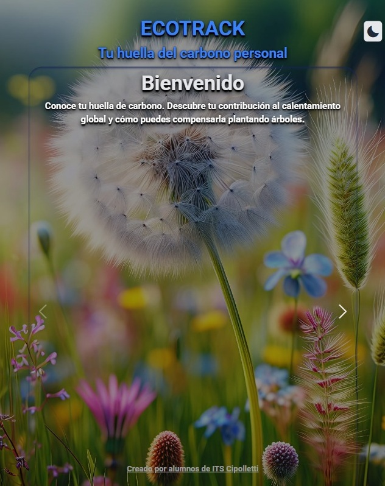
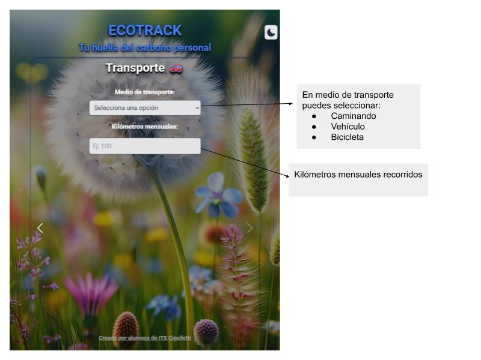
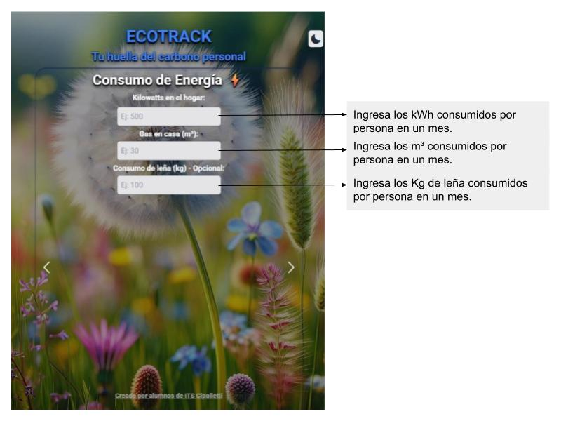
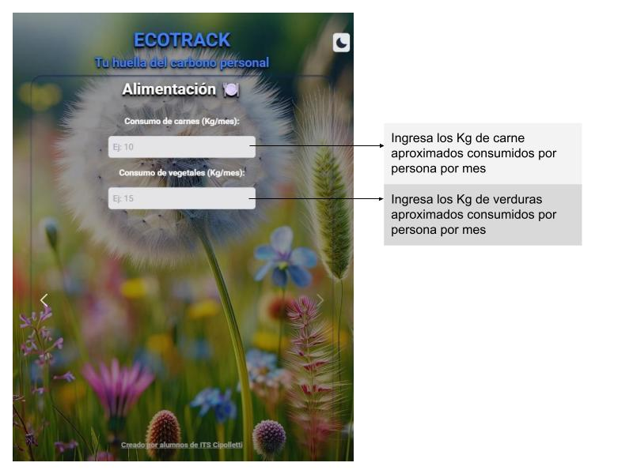

# ECOTRACK
## Introducción
La huella de carbono es un indicador ambiental que mide la cantidad total de gases de efecto invernadero (GEI) emitidos de forma directa o indirecta por **actividades humanas:**
1. Consumo de energía.
1. Transporte.
1. Producción y consumo de bienes y servicios. 

Se expresa en toneladas de CO₂ equivalente y cuantifica el impacto de una persona, hogar, empresa, producto o país en el cambio climático. 

## Nuestra App


ECOTRACK es una App adaptable a las pantallas de diferentes dispositivos que esta diseñada para calcular la huella de carbono personal anual (o la de tu hogar). Esto quiere decir la cantidad de Kg de CO₂ (equivalente) que produduce tu actividad o la de tu hogar a lo largo de un año. También brinda información aproximada de cuantos arboles son necesarios plantar para compensar la contaminación producida.

## Calcula la cantidad de CO² que liberan en tus actividades en un año

### Pantallas de ingreso de datos

En la pantalla **Transporte** debes:



1. Seleccionar tu medio de transporte habitual. 
1. Ingresar los kilometros mensuales aproximados que recorres. 


En la pantalla **Consumo de energía** debes:



1. Ingresar el número de **kWh** que consumes por mes en el campo **Kilowatts en el hogar**. 

#### ¿Como obtienes este dato?
Recuerda que en Argentina los datos de consumo en kWh son bimestrales. De manera que si en tu boleta figura por ejemplo: 400 kWh debes dividir por 2.

* 400 kWh/2 = 200 kWh

Otra cosa a tener en cuenta es que si en tu hogar viven 4 personas, los 200 kWh de consumo mensual deben dividirse por 4.

* 200 kWh/4 = 50 kWh
Por lo que tu consumo mensual es de 50 kWh.

2. Ingresar el número de **m³**  de gas que consumes por mes en el campo **Gas en casa**. 
#### ¿Como obtienes este dato?
Recuerda que en Argentina los datos de **m³** de gas se muestran como 6 grupos bimestrales de consumo. De manera que si en tu boleta figura: 

 

Segun esta boleta debes sumar 934 m³+ 222 m³ + 110 m³ + 144 m³ + 553 m³ + 1349 m³ y dividirlo en 12 meses.
* (934 m³ + 222 m³ + 110 m³ + 144 m³ + 553 m³ + 1349 m³)/12 = 276 m³ mensuales en el hogar. 
Pero si en tu hogar viven 4 personas seria 276 m³ dividido 4:
* 276/4 = **69 m³ mensuales por persona.**
3. Ingresar el número de **Kg** de consumo de leña (opcional).
Un calculo aproximado seria: Si una familia de 4 personas que come un asado por mes, consume  8 Kg de leña o carbón en el fuego , la persona debe ingresar 2 kg de leña por mes.

En la pantalla **Alimentación** debes:



<span style="color: red;">En construcción </span>

## Tecnología Utilizada
Para realizar esta app se utilizo:
* HTML.
* Vanilla Javascript.
* Framework Tailwind CSS.
* Libreria Swiper.

## Pasos técnicos de instalación/ejecución.
<span style="color: red;">En construcción </span>

## Código Importante
<span style="color: red;">En construcción </span>

### Función para cambiar el tema DARK/LIGTH de tailwind CSS
``` javascript
const setTheme = (theme) => {
    if (theme === 'dark') {
        htmlElement.classList.add('dark');
        icon.classList.remove('bxs-moon');
        icon.classList.add('bxs-sun');
    } else {
        htmlElement.classList.remove('dark');
        icon.classList.remove('bxs-sun');
        icon.classList.add('bxs-moon');
    }
    localStorage.setItem('theme', theme);
};
```


